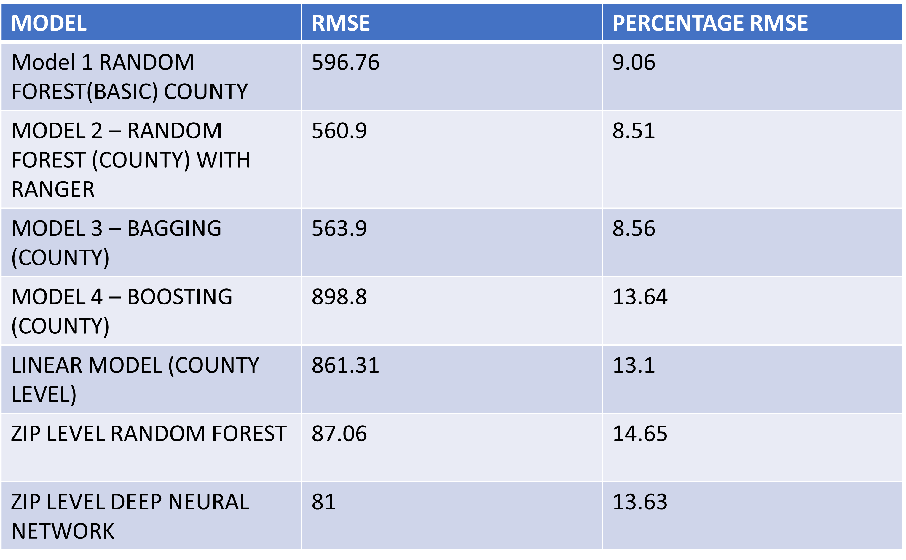
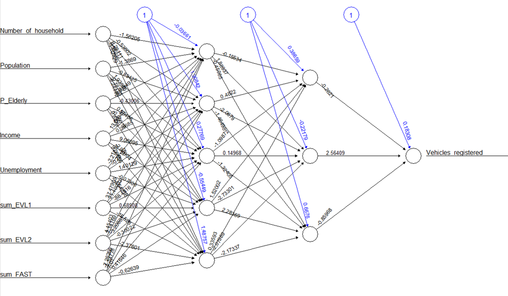

# Statistical_learning_project
Class project - Statistical Learning and Analysis  
**Predicting the Total Number of Registered Electric Vehicles in Texas for 2022 Using Machine Learning Approach**  
All the csv files and the codes have been uploaded here 

Final code for random forest model at county level - RF_Bag_GBM_county.R   
Many data cleaning steps were done in the same files  
Final code for random forest at zip level - RF_zip.R   
Final code for neural network model - neural_network_zip.R   
Final linear model - linear model.R  
Code for cleaning the energy profile data - energy_profile_data_clean.R  
Code for cleaning other dataset(some dataset cleaning done in the individual models only) - Data_cleaning.R  

The final result for all the models are given in the table -  

  

A neural network was performed at the zip code level using two hidden layers consisting of 5 and 3 nodes respectively. The network is shown in Figure given below. The test RMSE is 81(13.63%), which is better than the RMSE obtained on ZIP level Random Forest. Therefore, with more hyperparameter tuning, neural network could potentially lower the RMSE even more.    

